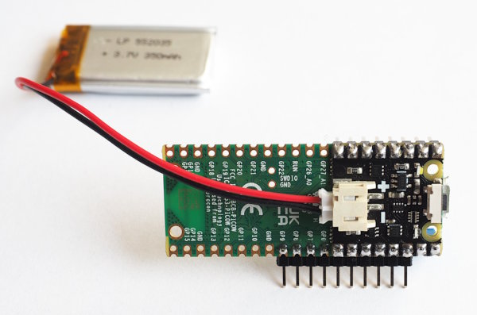
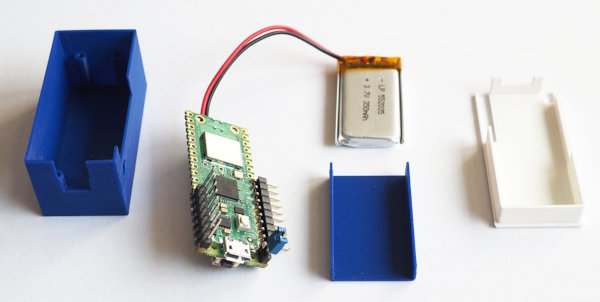
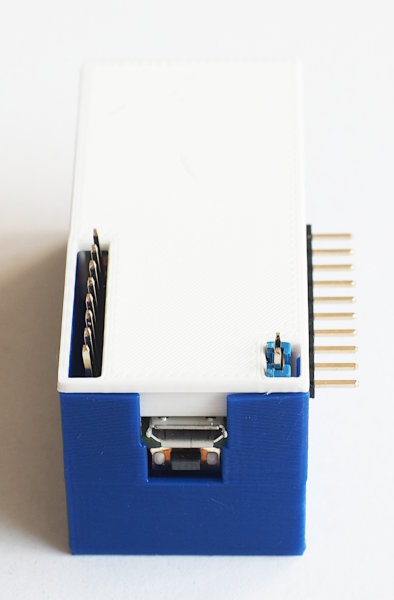

A case for the Pico with Pimoroni's Lipo-Shim
=============================================

This project provides the 3D-design-files (OpenSCAD) for a case
for the Pico with an attached Lipo-Shim and a small LiPo-battery.

The design is optimized for use with this
[LogicAnalyzer](https://github.com/gusmanb/logicanalyzer) but can
be adapted for any other use-case.

There are three printable parts:

  - the main case
  - a battery shield
  - the top lid

The dimensions (all in `dimensions.scad`) are tight and have to be
adapted to your printer. You can use screws to fasten the Pico to
the case, but that was not necessary in my case.

Mods
----

The Lipo-Shim has two leds, one for power and one for charging. The
latter does not hurt, but in battery operation you can minimize
current draw by destroying the power-led.

In contrast, if you want to better see the power-status, just connect
a led (+resistor) to the 3V3 pin. Adapting the design for this
mod would be useful (pull requests are welcome). 

License
-------

[![CC BY-SA 4.0][cc-by-sa-shield]][cc-by-sa]

This work is licensed under a
[Creative Commons Attribution-ShareAlike 4.0 International
License][cc-by-sa].

[![CC BY-SA 4.0][cc-by-sa-image]][cc-by-sa]

[cc-by-sa]: http://creativecommons.org/licenses/by-sa/4.0/
[cc-by-sa-image]: https://licensebuttons.net/l/by-sa/4.0/88x31.png
[cc-by-sa-shield]:
https://img.shields.io/badge/License-CC%20BY--SA%204.0-lightgrey.svg
